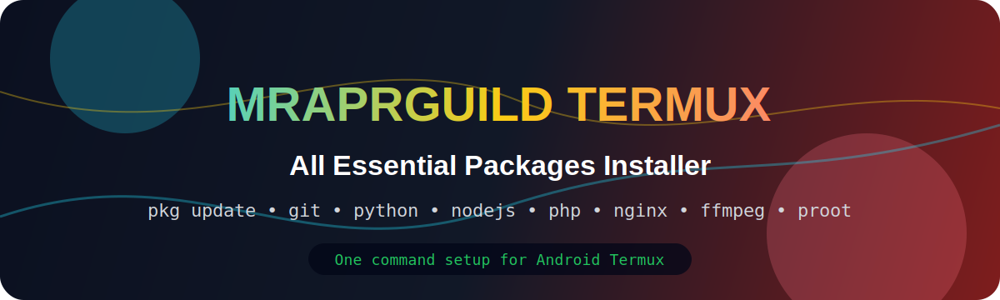
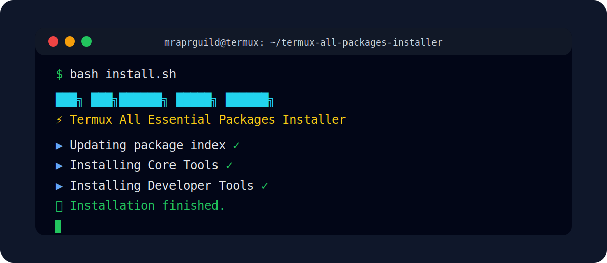

<p align="center">
  
</p>

<h1 align="center">⚡ Mraprguild Termux All Packages Installer</h1>

<p align="center">
  <b>One command Termux setup for development, web server tools, networking, media tools, archives, and Linux/proot usage.</b>
</p>

<p align="center">
  
  
  
  
</p>

<p align="center">
  
</p>

---

## 🔥 About This Project

**Mraprguild Termux All Packages Installer** is a GitHub-ready Termux project that installs a strong collection of useful packages in one setup script.

It is built for users who want a fresh Termux environment for:

- Android terminal customization
- Coding and development
- Python, Node.js, PHP, Ruby and C/C++ tools
- Web server testing with Apache/Nginx/PHP/MariaDB
- Network tools
- Archive tools
- FFmpeg and image tools
- Linux/proot setup
- Basic Python utilities

> ⚠️ This project does **not** install literally every package from the Termux repository. Installing every package can waste storage, cause package conflicts, and make Termux slow. This project installs a safe, powerful essential package collection.

---

## ✨ Features

| Feature | Details |
|---|---|
| ✅ One command installer | Clone and run the project with a single command |
| ✅ Animated terminal UI | Color banner, spinner, status lines and clean summary |
| ✅ Safe package groups | Installs useful groups instead of dangerous full repository install |
| ✅ Error tolerant | Skips unavailable packages and continues setup |
| ✅ Storage setup | Runs `termux-setup-storage` |
| ✅ Developer ready | Python, Node.js, PHP, Ruby, Clang, Make, CMake |
| ✅ Web server ready | Apache, Nginx, MariaDB, SQLite, PHP Apache module |
| ✅ Media tools | FFmpeg, ImageMagick, ExifTool |
| ✅ Linux tools | Proot and proot-distro support |
| ✅ GitHub ready | README, LICENSE, package list, workflow and clean folder structure |

---

## 📦 Single Command Install

```bash
pkg update -y && pkg install -y git && git clone https://github.com/Mraprguild/termux-all-packages-installer.git && cd termux-all-packages-installer && chmod +x install.sh && bash install.sh
```

---

## 🧰 Manual Install

```bash
git clone https://github.com/Mraprguild/termux-all-packages-installer.git
cd termux-all-packages-installer
chmod +x install.sh
bash install.sh
```

---

## 📁 Project Structure

```text
termux-all-packages-installer/
├── assets/
│   ├── banner.svg
│   └── terminal-demo.svg
├── .github/
│   └── workflows/
│       └── shellcheck.yml
├── install.sh
├── packages.list
├── README.md
├── LICENSE
└── .gitignore
```

---

## 📚 Package Categories

### 1. Core Tools

Useful daily Termux tools.

```text
git wget curl nano vim micro less tree neofetch figlet toilet
openssh openssl-tool termux-api jq bc htop tmux screen
```

### 2. Developer Tools

Programming and build tools.

```text
python python-pip nodejs php ruby clang make cmake pkg-config
autoconf automake libtool binutils gdb
```

### 3. Web Server Tools

Local web development tools.

```text
apache2 nginx mariadb sqlite php-apache
```

### 4. Network Tools

Network testing and diagnostics.

```text
nmap dnsutils whois traceroute net-tools iproute2 openssh
```

### 5. Archive Tools

Compress and extract many file formats.

```text
zip unzip tar gzip bzip2 xz-utils p7zip unrar
```

### 6. Media Tools

Video, image and metadata tools.

```text
ffmpeg imagemagick exiftool
```

### 7. Linux / Proot Tools

Run Linux distributions inside Termux.

```text
proot proot-distro
```

### 8. Python Tools

Installed with `pip`.

```text
requests flask rich colorama yt-dlp speedtest-cli
```

---

## 🧪 Test Commands After Install

```bash
neofetch
python --version
node --version
php -v
nginx -v
apachectl -v
proot-distro list
ffmpeg -version
```

---

## 🌐 Web Server Quick Start

### Start Apache

```bash
apachectl start
```

Default web folder:

```bash
$PREFIX/share/apache2/default-site/htdocs
```

### Start PHP Server

```bash
php -S 127.0.0.1:8080
```

Open in browser:

```text
http://127.0.0.1:8080
```

### Start MariaDB

```bash
mysqld_safe -u root &
```

---

## 🐧 Proot Linux Quick Start

Show available distros:

```bash
proot-distro list
```

Install Ubuntu:

```bash
proot-distro install ubuntu
```

Login to Ubuntu:

```bash
proot-distro login ubuntu
```

---

## 🎨 Animation Details

This project includes three animation layers:

1. **GitHub README animation** using SVG banner and terminal preview.
2. **Termux terminal animation** using spinner/status animation inside `install.sh`.
3. **Branded ASCII banner** for Mraprguild inside the installer.

The installer uses colors, icons and status indicators:

```text
▶ Updating package index
✓ Updating package index
▶ Installing Core Tools
Installing: git                   OK
Installing: wget                  OK
```

---

## 🛠️ GitHub Upload Commands

Create a new GitHub repository named:

```text
termux-all-packages-installer
```

Then upload:

```bash
git init
git add .
git commit -m "Initial Mraprguild Termux installer"
git branch -M main
git remote add origin https://github.com/Mraprguild/termux-all-packages-installer.git
git push -u origin main
```

---

## 🔄 Update Project Later

```bash
git add .
git commit -m "Update Termux package installer"
git push
```

---

## 🧯 Troubleshooting

### Package not found

Run:

```bash
pkg update -y
termux-change-repo
```

Select another mirror, then run the installer again.

### Storage permission not working

Run:

```bash
termux-setup-storage
```

Then allow storage permission from Android settings.

### Play Store Termux problem

Use Termux from F-Droid or GitHub releases. The Play Store version is outdated.

### Slow download speed

Run:

```bash
termux-change-repo
```

Choose a faster mirror near your region.

---

## ⚠️ Important Notes

- Use this only in Termux.
- Do not run random scripts from unknown sources.
- Some packages may be unavailable depending on your Termux mirror or Android version.
- This script is for setup and learning. It does not bypass Android system restrictions.

---

## 👤 Author

**Mraprguild**  
GitHub: `https://github.com/Mraprguild`

---

## 📜 License

MIT License
